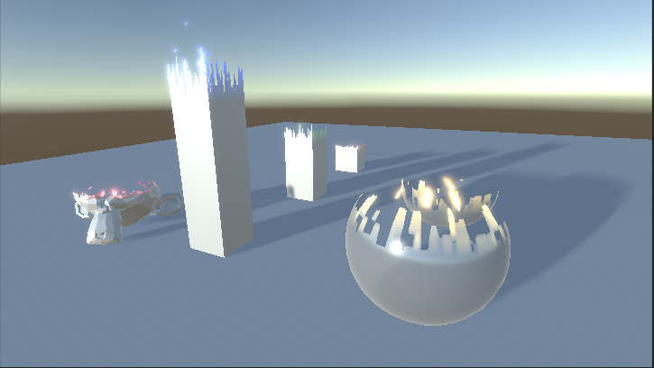

# Unity3D Dissolve by Distance & Dissolve by Height

This repository provides a shader to dissolve objects by distance from a world position or by height in world units.   

* The shader files [Assets/Dissolve/shaders](Assets/Dissolve/shaders)

1. _Dissolve Center_ is a Worldspace Position from where the dissolve effects originates
2. _Dissolve Distance_ length (world units) of the dissolve starting from the center 
3. _Dissolve Interpolation_ if and how far the interpolation should take place. If zero, there dissolve effect has no interpolation. 
4. _Dissolve Texture_ Texture used for interpolation
5. _Dissolve Color_ Emissive color on the dissolve edge