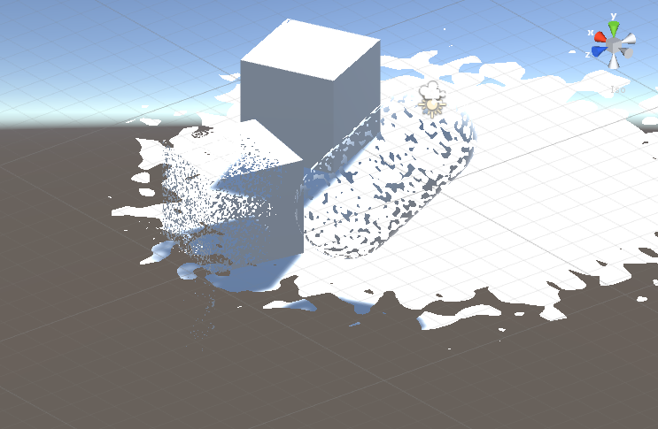
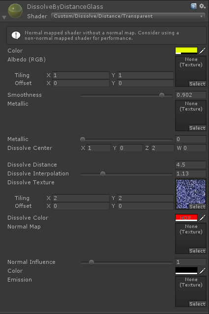

# Unity3D Dissolve by Distance

This repository provides a shader to dissolve objects by distance from a world position.  

 

* The shader file [Assets/DissolveByDistance/DissolveByDistance.shader](Assets/DissolveByDistance/DissolveByDistance.shader)
* The noise for interpolation [Assets/DissolveByDistance/noise.png](Assets/DissolveByDistance/noise.png)

1. _Dissolve Center_ is a Worldspace Position from where the dissolve effects originates
2. _Dissolve Distance_ length (world units) of the dissolve starting from the center 
2. _Dissolve Interpolation_ if and how far the interpolation should take place. If zero, there dissolve effect has no interpolation. 
3. _Dissolve Texture_ Texture used for interpolation